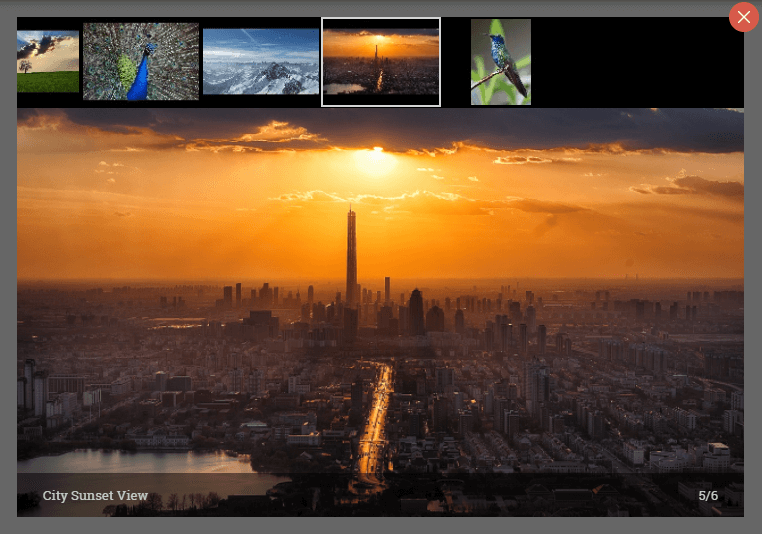

<p align="center">
  
</p>
<h1 align="center">Angular Image Gallery</h1>

Angular image gallery simplifies the process of creating beautiful image gallery for the web and mobile devices.


[](https://murhafsousli.github.io/ng-gallery/)
[](https://www.npmjs.com/package/ng-gallery)
[](https://travis-ci.org/MurhafSousli/ng-gallery)
[](https://www.npmjs.com/package/ng-gallery)
[](/LICENSE)

<p align="center">
  
</p>

## Installation

Install it with npm

`$ npm install --save @angular/cdk ng-gallery`

This plugin depends on Angular CDK for the lightbox feature, you don't need to import anything from the CDK, just make sure that it is installed in the project.

### SystemJS

If you are using SystemJS, you should also adjust your configuration to point to the UMD bundle.

In your systemjs config file, `map` needs to tell the System loader where to look for `ng-gallery`:

```js
map: {
  'ng-gallery': 'node_modules/ng-gallery/bundles/ng-gallery.umd.js',
}
```

Here is a [stackblitz](https://stackblitz.com/edit/ng-gallery)

## Usage

1. Import `GalleryModule.forRoot(...)` in the root module

Import `GalleryModule` and set the gallery configuration in your root module

```ts
  import { BrowserAnimationsModule } from  '@angular/platform-browser/animations';
  import { GalleryModule } from 'ng-gallery';

  export const config : GalleryConfig = {
    // ...
  }

  @NgModule({
   imports: [
      // ...
      BrowserAnimationsModule,
      GalleryModule.forRoot(config)
   ]
  })
```

2. Load images into the gallery

 Add images into the gallery by using the service `Gallery.load(...)`, see [basic example](https://murhafsousli.github.io/ng-gallery/#/basic).

 Alternatively, you can automatically add images using the directive `[gallerize]`, see [auto-detect example](https://murhafsousli.github.io/ng-gallery/#/auto-detect).


 After that use will be able to use `<gallery></gallery>` component to display the gallery in the template.

 Or if you want to open the gallery in an overlay, use the service `Gallery.open()`, see [gallery lightbox example](https://murhafsousli.github.io/ng-gallery/#/lightbox).

### Load image

 Use the service `Gallery` to load images

```ts
import { Gallery, GalleryItem } from 'ng-gallery';

export class AppComponent implements OnInit {

  constructor(public gallery: Gallery) { }

  ngOnInit() {
    const images: GalleryItem[] = [
      {
        src: 'assets/clouds.jpg',
        thumbnail: 'assets/clouds.jpg',
        text: 'Sky & Clouds'
      },
      // ...
    ];

    this.gallery.load(images);
  }
}
```

### Auto-detect

The directive `[gallerize]` will automatically detect all images inside the host element and hook them with the gallery lightbox.

This feature is useful in case you get the images as HTML string such as WordPress API

```html
<div gallerize>
  
  
  
</div>
```

If `src-full` attribute is not defined, `src` will beused for the full size.

You can also detect images using their class, `[gallerize]="'class-name'"`

```html
<div gallerize="cars">
  
  
  
</div>
```

### Gallery Functions

| Function Name         | Description                                         |
| --------------------- | --------------------------------------------------- |
| **setConfig(config)** | Set gallery config                                  |
| **load(items)**       | Load new items and reset the state                  |
| **set(index)**        | Set active item                                     |
| **next()**            | Set next item                                       |
| **prev()**            | Set prev item                                       |
| **play()**            | Start slide show                                    |
| **stop()**            | End slide show                                      |
| **open(index?)**      | Open gallery lightbox                               |
| **close()**           | Close gallery lightbox                              |
| **reset()**           | Reset gallery to initial state                      |

### Gallery Events

| Event Name            | Description                                         |
| --------------------- | --------------------------------------------------- |
| **initialized()**     | Emits when gallery is initialized/reset             |
| **loaded()**          | Emits when images is loaded into the gallery        |
| **imageChanged()**    | Emits when image is changed                         |
| **imageLoading()**    | Emits when image lazy loading is started/completed  |
| **navigationClick()** | Emits when navigation is clicked                    |
| **thumbnailClick()**  | Emits when thumbnail is clicked                     |
| **bulletClick()**     | Emits when bullet is clicked                        |
| **opened()**          | Emits when lightbox is opened                       |
| **closed()**          | Emits when lightbox is closed                       |
| **playing()**         | Emits when slide show is started                    |
| **stopped()**         | Emits when slide show is stopped                    |

### Gesture Support (optional)

Gallery Module relies on HammerJS for gestures, make sure it is loaded into the application.

*You can add HammerJS to your application via [npm](https://www.npmjs.com/package/hammerjs), a CDN (such as the [Google CDN](https://developers.google.com/speed/libraries/#hammerjs)), or served directly from your app.*

To install via npm, use the following command:

`$ npm install --save hammer.js`

After installing, import it on your app's root module

```ts
import 'hammerjs';
```

## Support

[](https://www.patreon.com/bePatron?u=5594898)

## Issues

If you identify any errors in this module, or have an idea for an improvement, please open an [issue](https://github.com/MurhafSousli/ng-gallery/issues). I am excited to see what the community thinks of this project, and I would love your input!

## Author

 **[Murhaf Sousli](http://murhafsousli.com)**

- [github/murhafsousli](https://github.com/MurhafSousli)
- [twitter/murhafsousli](https://twitter.com/MurhafSousli)
